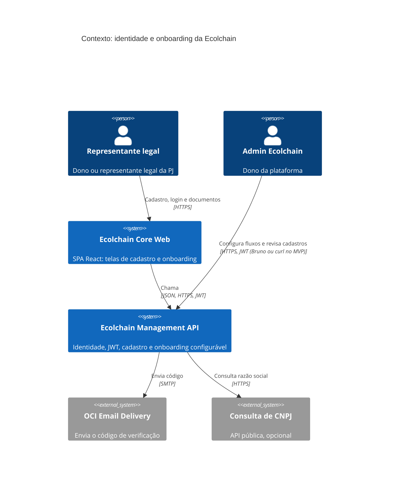
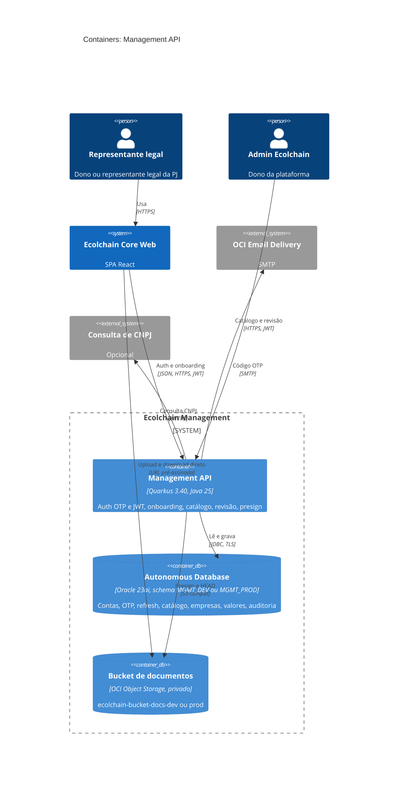
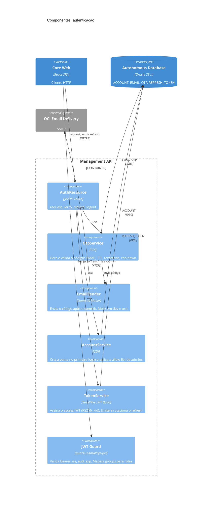
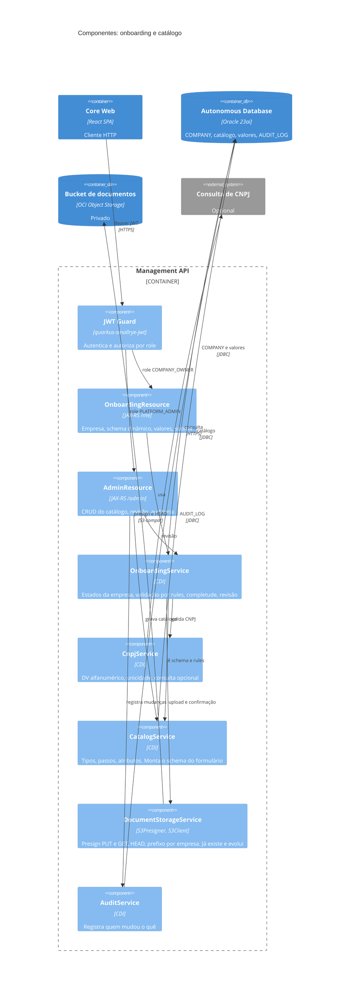
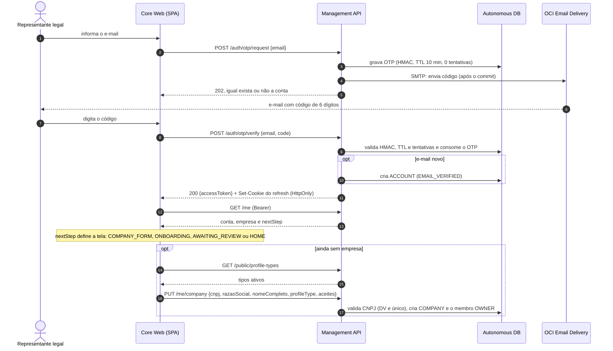
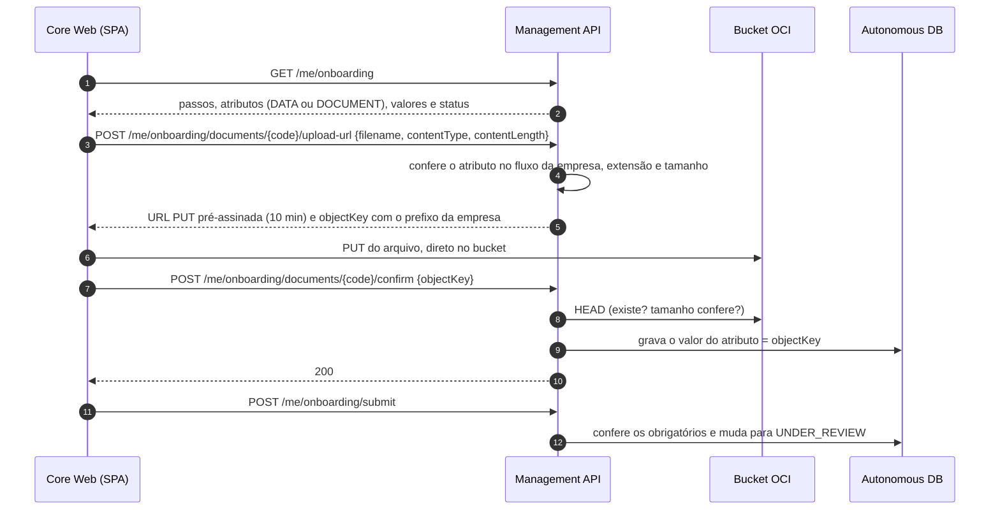
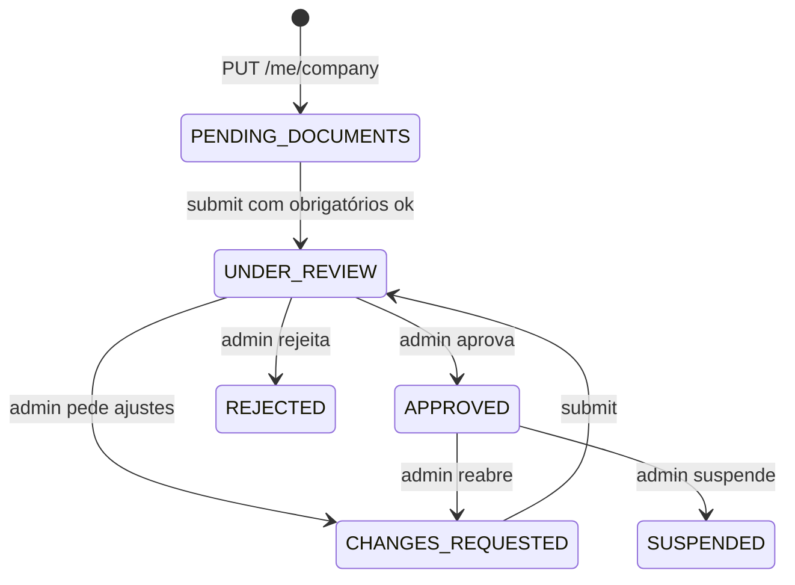
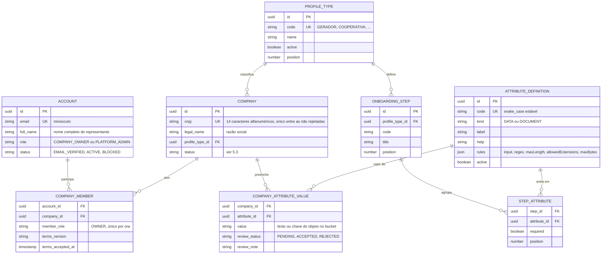

# Proposta: sign-up / sign-in com JWT e onboarding configurável

> **Status:** rascunho para discussão · **Escopo:** MVP · **Repo:** `ecolchain-management-api`
>
> Para a conversa, o essencial está nas seções 3 (decisões D1 a D12), 4 (C4) e 6 (perguntas abertas). Os anexos A, B e C têm o detalhe: modelo de dados, endpoints, segurança.
>
> **Lacuna:** a lista de dados e documentos por tipo de perfil não veio na mensagem (só os 6 nomes). O catálogo nasce com os 6 tipos e **sem atributos**; os exemplos abaixo são ilustrativos.

Os diagramas são Mermaid: o GitHub renderiza direto e o preview de Markdown do IntelliJ também (pode pedir para baixar a extensão na primeira vez).

## 1. Resumo e escopo

1. **E-mail + código (OTP), sem senha.** O mesmo fluxo faz sign-up e sign-in.
2. **JWT** emitido pela própria API (RS256): access token curto + refresh token rotativo. Chaves geradas localmente no MVP.
3. **Cadastro em 2 passos:** (1) e-mail + código; (2) CNPJ, razão social, nome completo e **tipo de perfil**.
4. **Onboarding dinâmico:** depois do cadastro o app pede dados e documentos conforme o tipo de perfil. Tipos, atributos e passos são **dados no banco, editados por endpoints de admin**: mudar o fluxo não exige deploy.
5. **Documentos** vão do navegador direto para o OCI Object Storage (URL pré-assinada). O banco guarda só a **chave (string)**.
6. **Revisão pelo admin** (aprova, pede ajustes ou rejeita) antes de a empresa ficar `APPROVED`.

**Dentro do MVP:** PJ (CNPJ); 1 login por empresa, do dono ou representante legal.
**Fora, por enquanto:** operadores e funcionários, PF, senha e 2FA, KYC automático, vínculo com carteira on-chain, painel web do admin (no MVP o admin usa Bruno ou curl) e troca de e-mail ou de titular do login (no MVP, só o admin faz, como suporte).

| Pedido | Onde está |
|---|---|
| Sign-in e sign-up com JWT no Quarkus, simples e seguro | D1 a D4, 5.1 |
| Chaves geradas localmente (MVP) | D3, C.1 |
| Cadastro por e-mail + código via OCI Email Delivery | D1, D11, 5.1, C.2 |
| CNPJ, nome completo, razão social, tipo de perfil | D10, 5.1 |
| Tipos de perfil servidos por endpoint do admin (6 iniciais) | D6, A, B |
| Só PJ; dono ou representante legal | D10, 5.1 |
| Documentos por tipo de perfil, valores como string, presign no bucket OCI | D6 a D8, 5.2, A |
| Admin muda fluxos sem deploy | D6, 3.1, A |
| Empresa só com o login dela (sem operadores) | D9 |
| Diagrama C4 | 4 |

## 2. O que já existe

| Peça | Hoje | Consequência |
|---|---|---|
| API | Quarkus 3.40 (Java 25), Panache, Flyway, Oracle ADB 23ai (`MGMT_DEV` e `MGMT_PROD`), OpenAPI, logs JSON. Pacote único `com.ecolchain.api` | Entram `quarkus-smallrye-jwt`, `quarkus-smallrye-jwt-build` e `quarkus-mailer`. O OpenAPI vira o contrato com o SPA |
| Documentos | `DocumentStorageService` gera URLs pré-assinadas (PUT 10 min, GET 5 min, máx. 25 MiB, extensões em allow-list). `DevDocumentResource` só existe no profile `dev` e **não tem auth**. A chave (`docs/<uuid>-<arquivo>`) **não tem dono** | Reaproveitar o serviço, acrescentando prefixo por empresa e checagem de dono (D8) |
| E-mail | Módulo Terraform `oci/email-delivery` em andamento (branch `feat/oci-email-delivery` do infra): Email Domain `ecolchain.com`, DKIM no Cloudflare, Approved Sender `ecolchain@ecolchain.com`, credencial SMTP. O README da API já documenta o uso (SMTP 465 com TLS implícito, mock em dev e test). **Limite da tenancy: 200 e-mails/24 h e 10/min** | Base do envio do OTP (D11). O limite exige rate limit desde o primeiro dia |
| Front | `ecolchain-core-web` (React; `app.ecolchain.com`, dev em `app-dev-tester.ecolchain.com`) hoje só conecta carteira Solana: não há login | Passa a usar `/auth` e `/me`. O login da empresa é separado da carteira |
| Hospedagem da API | Ainda não existe no infra | Afeta cookie, CORS e entrega das chaves (seção 6, pergunta 9) |
| On-chain | `Participante.kyc_hash` é informado pelo operador no cadastro on-chain. Os papéis on-chain (Coletor, Cooperativa, Transportador, Indústria) diferem dos 6 tipos desta proposta | Futuro: esta API vira a fonte do cadastro/KYC off-chain e do `kyc_hash`. Fora do escopo agora |

## 3. Decisões propostas

| # | Tema | Proposta | Por quê / alternativa |
|---|---|---|---|
| D1 | Credencial | E-mail + código numérico (OTP) de 6 dígitos, **sem senha**. O mesmo `request`/`verify` serve para sign-up e sign-in | Não há senha para guardar, vazar ou resetar, e a resposta é igual exista ou não a conta (sem enumeração). Alternativa: senha + OTP só no cadastro (mais atrito e mais superfície) |
| D2 | Sessão | **Access JWT** de 15 min (RS256) + **refresh token opaco** de 7 dias, rotativo, com detecção de reuso. Refresh em cookie `HttpOnly; Secure; SameSite=Strict; Path=/auth`; access em memória no SPA | Token curto limita o estrago e o refresh permite logout e revogação de verdade. Exige a API sob `*.ecolchain.com` (mesmo site do SPA); se não der, o refresh vai no corpo da resposta. Alternativa mais simples: um único JWT de 1 a 8 h, sem revogação |
| D3 | Chaves JWT (MVP) | Par RSA 2048 gerado por script local; **a privada fica fora do git**; `kid` no header; no deploy a chave entra por arquivo montado ou variável de ambiente | Detalhes em C.1. Evolução: OCI Vault e rotação com JWKS |
| D4 | Autorização | Claim `groups` = `COMPANY_OWNER` ou `PLATFORM_ADMIN`; `@RolesAllowed` por prefixo (`/me/**`, `/admin/**`); deny by default nas demais rotas. Estado da conta e da empresa é lido do banco, não do token. Em `/admin/**` o papel também é conferido no banco | O token só prova identidade. Regra de negócio fica sempre no servidor, e a conferência no banco reduz o estrago se a chave vazar |
| D5 | Admin | Allow-list de e-mails em config (`app.auth.admin-emails`): quem estiver nela vira `PLATFORM_ADMIN` no primeiro login | Bootstrap mínimo. Depois: convite de admins por endpoint e 2º fator |
| D6 | Catálogo dinâmico | `PROFILE_TYPE` → `ONBOARDING_STEP` → `STEP_ATTRIBUTE` → `ATTRIBUTE_DEFINITION` no banco, editados por endpoint. A API devolve o **schema do formulário** e o SPA só renderiza | Exigir outro documento ou dado vira 1 chamada, sem deploy da API nem do SPA |
| D7 | Valores | Tudo `VARCHAR2`: dado = texto; documento = **chave do objeto** no bucket | Como pedido. A validação (regex, tamanho, extensão) vem das `rules` do atributo e só pode **restringir** a política global (`app.docs.*`) |
| D8 | Documentos | Presign PUT → upload direto → `confirm` (a API faz HEAD no objeto). Chave `docs/<companyId>/<atributo>/<uuid>-<arquivo>`; a API só aceita chaves do prefixo da empresa | Impede que uma empresa "reivindique" arquivo de outra (IDOR). Reaproveita TTL e limite atuais |
| D9 | Tenant | `ACCOUNT` ↔ `COMPANY_MEMBER` (role `OWNER`) ↔ `COMPANY`, com 1 membro por empresa | Operadores e funcionários entram depois com novas linhas e convite, sem migrar dados |
| D10 | Empresa (PJ) | Núcleo fixo: CNPJ, razão social, nome completo, tipo de perfil. CNPJ validado por dígito verificador (**já aceita o formato alfanumérico**, em vigor desde jul/2026) e único entre as empresas não rejeitadas; consulta pública opcional só para pré-preencher a razão social. Declaração "sou dono ou representante legal" + aceite de termos versionado | **Nome completo** (a pessoa) e **razão social** (a empresa) não são a mesma coisa: coincidem só em EI e MEI (no MEI a razão social vem com o CPF). Pedimos os dois |
| D11 | E-mail | OCI Email Delivery por SMTP via Quarkus Mailer, como já definido no módulo de infra e no README. Mock em dev e test | Detalhes em C.2 |
| D12 | Aprovação | Revisão manual do admin: aprova, pede ajustes (com motivo) ou rejeita, por documento e no geral | Mínimo razoável para cadastro regulado. Evolui para regras automáticas |

**Alternativa descartada no MVP:** IdP gerenciado (OCI IAM Identity Domains, Keycloak, Auth0). Entrega MFA, reset e login social prontos, mas é mais uma peça para operar e pagar, e o onboarding dinâmico continuaria sendo da API. Se um dia entrar, tende a ser troca de configuração de verificação do token, não de regra de negócio.

### 3.1 O que é dinâmico e o que é estático

| Dinâmico (admin, por endpoint, sem deploy) | Estático (código ou config, muda com deploy ou restart) |
|---|---|
| Tipos de perfil: nome, descrição, ativo, ordem | Núcleo da empresa: e-mail, CNPJ, razão social, nome completo, tipo |
| Atributos: rótulo, ajuda, `DATA` ou `DOCUMENT`, regras (regex, tamanho, extensões) | OTP e JWT: algoritmo, TTLs, limites de tentativa |
| Passos do fluxo, ordem, obrigatório ou opcional | Roles e matriz de autorização |
| Decisões de revisão por documento e por empresa | Máquina de estados da empresa e política global de upload (`app.docs.*`) |

Os parâmetros de segurança ficam estáticos de propósito: menos superfície de ataque se um admin for comprometido.

## 4. Arquitetura (C4)

### 4.1 Contexto (nível 1)



### 4.2 Containers (nível 2)



### 4.3 Componentes: autenticação (nível 3)



### 4.4 Componentes: onboarding e catálogo (nível 3)



Pacotes sugeridos em `com.ecolchain.api`: `auth`, `onboarding`, `catalog`, `documents` (o serviço atual muda para cá) e `common`. Persistência com Panache em cada pacote.

O diagrama de deployment fica para quando a hospedagem da API for definida (pergunta 9). Os fluxos dinâmicos estão na seção 5.

## 5. Fluxos

### 5.1 Sign-up e sign-in (mesmo caminho)



### 5.2 Documento (presign → upload direto → confirmação)



### 5.3 Estados da empresa



O `nextStep` é calculado no servidor a partir desses estados. O SPA não carrega regra de fluxo.

## 6. Perguntas em aberto

1. **Lista de dados e documentos por tipo de perfil.** Não chegou. Pode colar? Com ela eu semeio o catálogo; sem ela, só os 6 tipos.
2. **Sem senha (D1)?** E-mail + código para entrar sempre, com refresh de 7 dias. Alguma razão para exigir senha ou 2FA já no MVP (principalmente para o admin)?
3. **Aprovação manual (D12).** Enquanto a empresa está em `PENDING_DOCUMENTS` ou `UNDER_REVIEW`, ela já pode usar alguma coisa da plataforma ou só vê o status?
4. **Troca de tipo de perfil.** Proposta: livre até submeter; depois só o admin troca. Ok?
5. **Mudou a regra com empresas já aprovadas** (novo documento obrigatório)? Proposta: ninguém é afetado sozinho, e o admin usa "reabrir" por empresa.
6. **Um tipo por empresa?** Hoje sim (também há 1 papel por carteira on-chain). Uma cooperativa que também transporta teria 2 cadastros?
7. **Nome completo e razão social:** confirmo pedir os dois, com a razão social pré-preenchida pela consulta de CNPJ quando disponível?
8. **Rótulos em vários idiomas** (o Core Web tem pt-BR, en-US e es-ES)? Proposta: só pt-BR no MVP.
9. **Hospedagem e domínio da API.** Condiciona o cookie de refresh (D2), o CORS e como a chave chega ao deploy.
10. **Chave JWT.** Confirmo: gerada localmente por script, fora do git e injetada no deploy? Ou prefere versionar um par só de dev?

## 7. Entrega em fatias

1. **Auth:** migrations de identidade, OTP com Mailer, JWT (com o script de geração de chaves), `/auth/*` e `/me`, com testes.
2. **Catálogo e cadastro:** catálogo e endpoints de admin, `PUT /me/company`, schema dinâmico, atributos `DATA`, seed dos 6 tipos (Gerador, Transportador, Cooperativa, CleanTech, Recicladora, Higienizadora) por migration.
3. **Documentos e revisão:** presign com prefixo e checagem de dono, `confirm`, `submit` e `review`.
4. **Em paralelo:** hospedagem da API no infra, aplicar o módulo de Email Delivery e uma coleção Bruno com os fluxos.

---

## Anexo A. Modelo configurável



Fora do diagrama: `EMAIL_OTP` (e-mail, hash do código, expiração, tentativas, consumido em), `REFRESH_TOKEN` (conta, família, hash, expiração, revogado em, substituído por) e `AUDIT_LOG` (ator, ação, entidade, antes, depois, quando).

Pontos de projeto:

- O **atributo é reutilizável**: o mesmo `licenca_operacao` pode entrar no fluxo de vários tipos, cada um com seu `required` e sua posição. A definição é **global**: mudar `label` ou `rules` afeta todos os tipos que usam o atributo.
- Tirar um atributo do fluxo **não apaga** valores já coletados (ficam para auditoria).
- Mudança de fluxo vale para quem ainda não submeteu. Empresa já aprovada não é afetada, a menos que o admin use "reabrir" (pergunta 5).
- `code` do atributo é a identificação estável (imutável) usada nos endpoints. Não confundir com a `objectKey` do bucket.
- A regex do admin só roda depois de checar `maxLength` (entrada limitada), para evitar ReDoS.
- **CNPJ reservado por terceiros:** como só provamos o e-mail, alguém poderia cadastrar primeiro o CNPJ de outra empresa. Por isso o CNPJ é único só entre empresas não rejeitadas: o admin rejeita o cadastro indevido e o CNPJ volta a ficar livre. Quem tenta um CNPJ já em uso vê uma mensagem para falar com a Ecolchain.

### Exemplo (ilustrativo): admin define o fluxo de um tipo em uma chamada

```http
PUT /admin/profile-types/COOPERATIVA/flow
```

```json
{
  "steps": [
    {
      "code": "licencas",
      "title": "Licenças e autorizações",
      "attributes": [
        {
          "code": "licenca_operacao",
          "required": true,
          "definition": {
            "kind": "DOCUMENT",
            "label": "Licença de operação",
            "help": "PDF de até 10 MB",
            "rules": { "allowedExtensions": ["pdf"], "maxBytes": 10485760 }
          }
        },
        { "code": "capacidade_mensal_kg", "required": false }
      ]
    }
  ]
}
```

`definition` é opcional: se o atributo já existe e a chamada não traz definição, ele é reaproveitado; se traz, é criado ou atualizado (upsert por `code`). O `PUT` substitui o fluxo inteiro em uma transação, o que permite versionar o JSON de cada tipo no Git e reaplicar em dev e prod. `POST /admin/profile-types` aceita o mesmo `steps`, então criar o tipo e seus atributos também é uma chamada só.

### Exemplo (ilustrativo): o que o SPA recebe em `GET /me/onboarding`

```json
{
  "status": "PENDING_DOCUMENTS",
  "profileType": { "code": "COOPERATIVA", "name": "Cooperativa" },
  "steps": [
    {
      "code": "licencas",
      "title": "Licenças e autorizações",
      "attributes": [
        {
          "code": "licenca_operacao",
          "kind": "DOCUMENT",
          "label": "Licença de operação",
          "help": "PDF de até 10 MB",
          "required": true,
          "rules": { "allowedExtensions": ["pdf"], "maxBytes": 10485760 },
          "value": null,
          "review": null
        }
      ]
    }
  ],
  "progress": { "requiredTotal": 1, "requiredFilled": 0 }
}
```

## Anexo B. Endpoints

Paths em inglês, como o código atual. O contrato completo sai do OpenAPI que o projeto já gera.

**Públicos**

| Método | Path | Descrição |
|---|---|---|
| POST | `/auth/otp/request` | `{email}`. Sempre 202 |
| POST | `/auth/otp/verify` | `{email, code}`. Devolve o access token e o cookie de refresh |
| POST | `/auth/refresh` | Cookie. Rotaciona o refresh e devolve novo access |
| POST | `/auth/logout` | Cookie. Revoga a família de refresh |
| GET | `/public/profile-types` | Tipos ativos, para o select do cadastro (cacheável) |
| GET | `/.well-known/jwks.json` | Chaves públicas (opcional no MVP) |

**Empresa (`COMPANY_OWNER`)**

| Método | Path | Descrição |
|---|---|---|
| GET | `/me` | Conta, empresa e `nextStep` |
| PUT | `/me/company` | Cria a empresa: CNPJ, razão social, nome completo, tipo, declaração e aceite de termos |
| GET | `/me/onboarding` | Schema dinâmico, valores atuais e status |
| PUT | `/me/onboarding/attributes/{code}` | Grava o valor de um atributo `DATA` |
| POST | `/me/onboarding/documents/{code}/upload-url` | Presign PUT |
| POST | `/me/onboarding/documents/{code}/confirm` | Confirma o upload (HEAD) e grava a chave |
| GET | `/me/onboarding/documents/{code}/download-url` | Presign GET |
| POST | `/me/onboarding/submit` | Confere os obrigatórios e envia para revisão |

**Admin (`PLATFORM_ADMIN`)**

| Método | Path | Descrição |
|---|---|---|
| GET, POST, PATCH | `/admin/profile-types[/{code}]` | CRUD de tipos (desativar em vez de apagar). `POST` aceita `steps` |
| PUT | `/admin/profile-types/{code}/flow` | Define passos e atributos de um tipo, de forma declarativa e atômica |
| GET, POST, PUT | `/admin/attributes[/{code}]` | Catálogo de atributos |
| GET | `/admin/companies?status=` | Fila de revisão |
| GET | `/admin/companies/{id}` | Empresa e valores |
| GET | `/admin/companies/{id}/documents/{code}/download-url` | Presign GET para revisar |
| POST | `/admin/companies/{id}/review` | `{decision, note, items[]}` com `APPROVE`, `REQUEST_CHANGES` ou `REJECT` |
| GET | `/admin/audit-log` | Trilha de mudanças de catálogo e revisões |

## Anexo C. Segurança, chaves e e-mail

### C.1 Chaves JWT no MVP

JWT não precisa de certificado X.509, só do par de chaves. O `.gitignore` já bloqueia `*.pem` e `*.key`.

```bash
mkdir -p keys
openssl genpkey -algorithm RSA -pkeyopt rsa_keygen_bits:2048 -out keys/jwt-private.pem
openssl pkey -in keys/jwt-private.pem -pubout -out keys/jwt-public.pem
```

Configuração (exemplo; validar os caminhos na implementação). Os caminhos vêm do `.env` (gitignored), como as credenciais S3:

```properties
mp.jwt.verify.publickey.location=${JWT_PUBLIC_KEY_LOCATION}
mp.jwt.verify.issuer=ecolchain-management-api
mp.jwt.verify.audiences=ecolchain-app
smallrye.jwt.sign.key.location=${JWT_PRIVATE_KEY_LOCATION}
smallrye.jwt.new-token.issuer=ecolchain-management-api
smallrye.jwt.new-token.audience=ecolchain-app
smallrye.jwt.new-token.lifespan=900
```

- **Local:** `keys/` na raiz do projeto, gerado por um script. Em dev e test, se nenhuma chave estiver configurada, o Quarkus gera um par efêmero (os tokens morrem a cada restart), por isso o par fixo.
- **Deploy:** a chave entra por arquivo montado (secret ou volume) ou por variável de ambiente. **Nunca dentro do jar ou da imagem**, e a privada nunca no git: quem a tem emite token como qualquer conta, inclusive admin (por isso `/admin/**` também confere o papel no banco).
- **Rotação (evolução):** `kid` no header já no MVP; na troca, o JWKS publica as duas chaves por um tempo. Depois, OCI Vault.

### C.2 E-mail (OCI Email Delivery)

A infra (domínio, DKIM, sender, credencial SMTP) e a configuração do Mailer já estão sendo tratadas no módulo `oci/email-delivery` e no README da API. Para o fluxo de auth, o que importa:

- O `From` precisa ser exatamente o Approved Sender (`ecolchain@ecolchain.com`).
- **Limite de 200 e-mails/24 h e 10/min** na tenancy: cada login sem refresh válido gasta um e-mail, e quem esgota a cota derruba o login de todo mundo. Mitigações: refresh de 7 dias, cooldown por e-mail e por IP, teto global diário com erro amigável quando perto do limite e, antes de abrir ao público, Cloudflare Turnstile no `request`. Aumento de limite exige SPF e DKIM (ver README do infra).
- O envio acontece **depois do commit** da transação, e o `request` nunca revela se o e-mail existe.
- Em `quarkus:dev` e nos testes o Mailer vem em mock (o código aparece no console e o `MockMailbox` lê o e-mail nos testes). Num deploy `dev` o envio é real e gasta a cota.
- O e-mail só leva o código, a validade e "se não foi você, ignore": sem link, para não treinar o usuário a clicar.
- Evolução: a credencial SMTP hoje fica no usuário do Terraform; o ideal é um usuário IAM dedicado só com `use email-family`.

### C.3 Parâmetros iniciais e checklist

Tudo em `application.properties` via `@ConfigMapping(prefix = "app.auth")`, como `DocumentsConfig` já faz.

| Item | Valor inicial |
|---|---|
| OTP | 6 dígitos (`SecureRandom`), validade 10 min, 5 tentativas, uso único. Guardado como HMAC-SHA256 com pepper de config, comparado em tempo constante |
| Reenvio | Cooldown 60 s; máx. 5 por hora por e-mail; teto por IP |
| Access JWT | 15 min, RS256, claims `iss`, `aud`, `sub` (id da conta), `groups`, `jti`; `kid` no header |
| Refresh | 7 dias (30 dias absolutos), 256 bits aleatórios, SHA-256 no banco, rotativo; reuso revoga a família |

Checklist:

- Resposta única para código errado, expirado ou inexistente. Conta `BLOCKED` não recebe token.
- Verificador com algoritmo fixo (sem `none`), validando `iss`, `aud` e `exp`.
- CORS restrito às origens do SPA. Refresh e logout por cookie exigem origem permitida e `SameSite=Strict`.
- Deny by default: tudo exige JWT, exceto `/auth/**`, `/public/**`, health e JWKS.
- Documentos: bucket privado (já é), URLs curtas, tipo e tamanho validados, chave com prefixo da empresa. Sem varredura de malware no MVP: só admin e o titular baixam, por URL assinada.
- Logs JSON (já em uso): nunca registrar OTP, tokens ou e-mail completo.
- Toda mudança de catálogo e toda revisão grava `AUDIT_LOG`.
- LGPD: aceite de termos versionado com data, finalidade e retenção definidas, acesso aos documentos só do titular e do admin.
- Testes: `@QuarkusTest` com `MockMailbox`; validador de CNPJ com o exemplo oficial da Receita (`12.ABC.345/01DE-35`); `ConfigGuardTest` estendido para garantir que nenhuma chave ou segredo entra no repo.

CNPJ: módulo 11 sobre os 12 primeiros caracteres, cada um convertido por `ASCII − 48`, pesos de 2 a 9 da direita para a esquerda. Armazenar como `VARCHAR2(14)` em maiúsculas, nunca como número. A consulta pública é só conveniência e nunca bloqueia: os provedores podem ainda não aceitar o formato alfanumérico.
