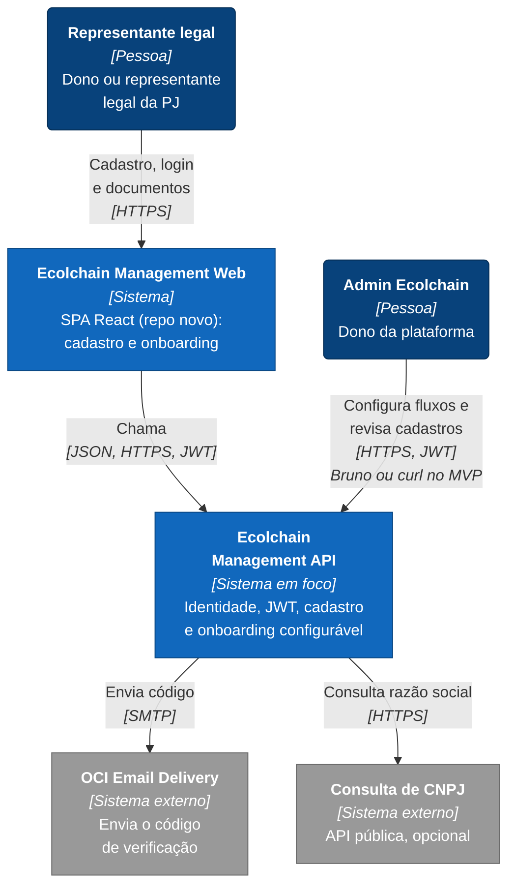
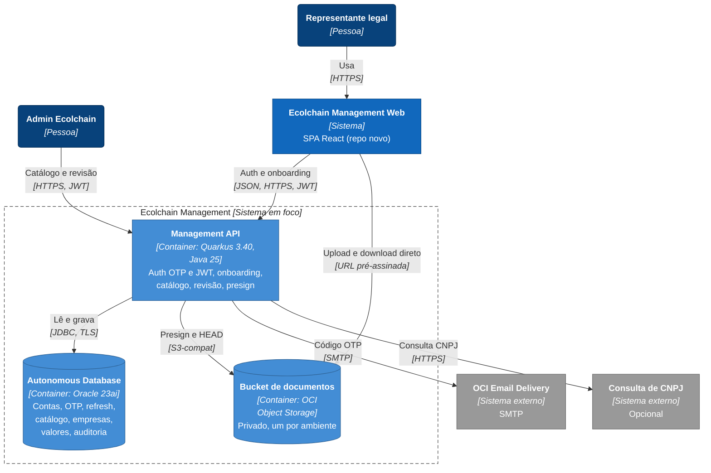
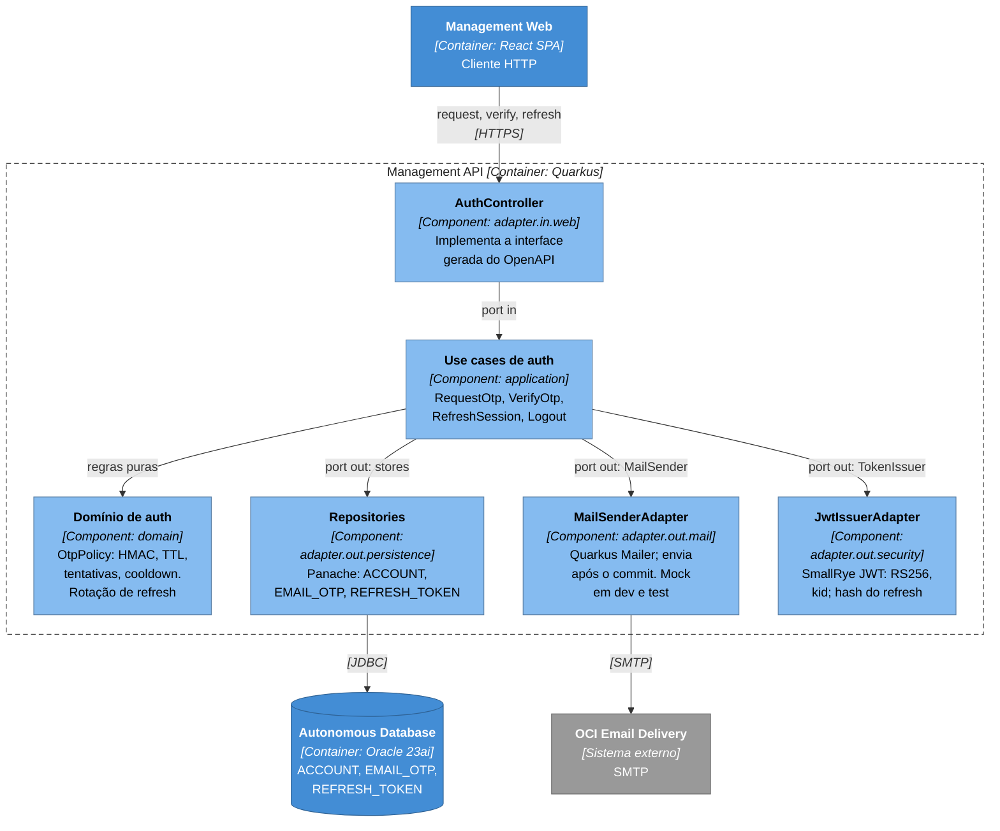
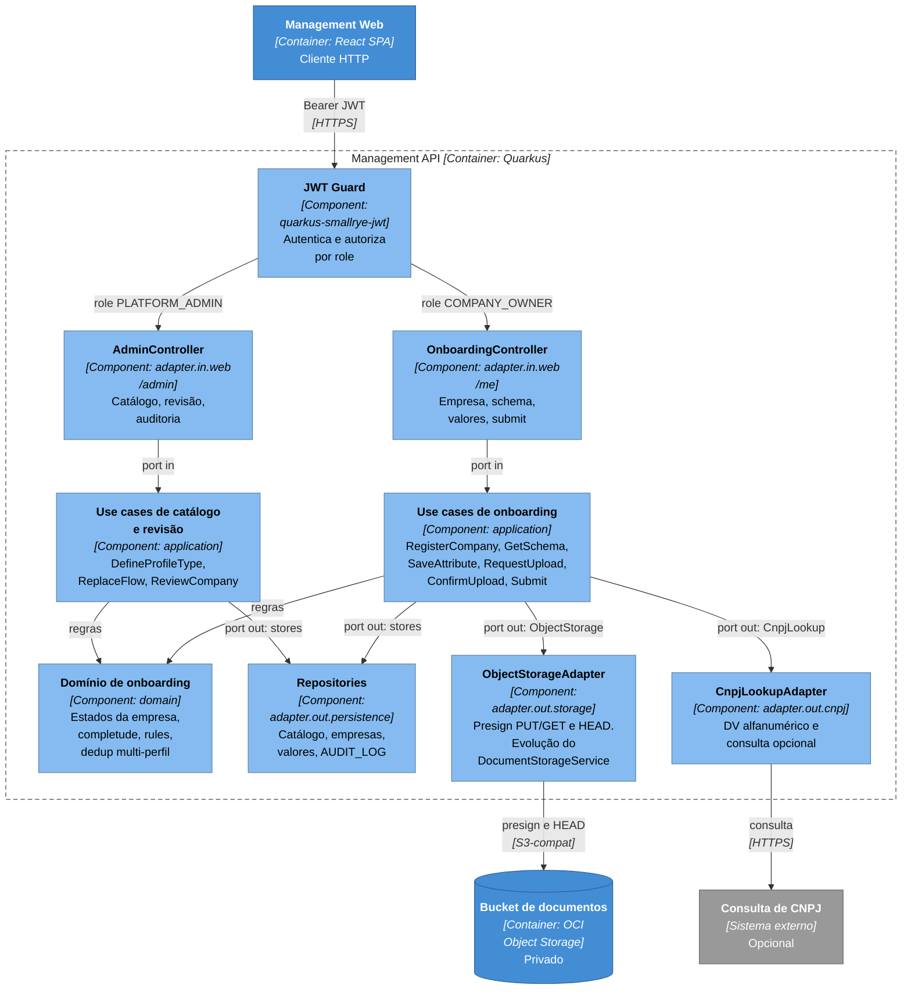
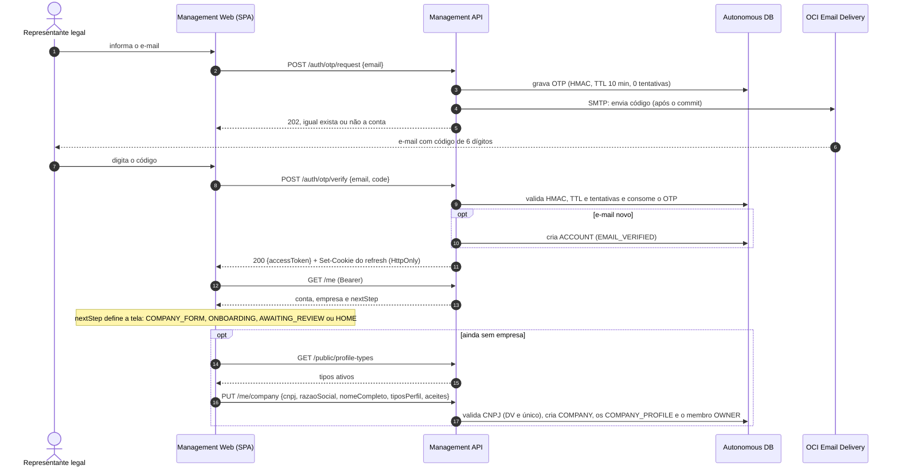
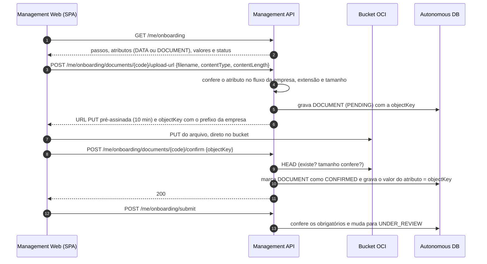
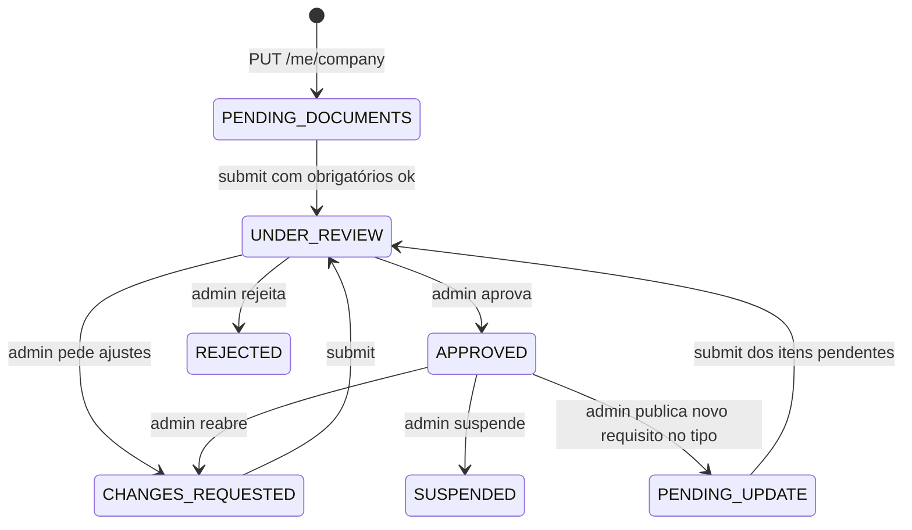
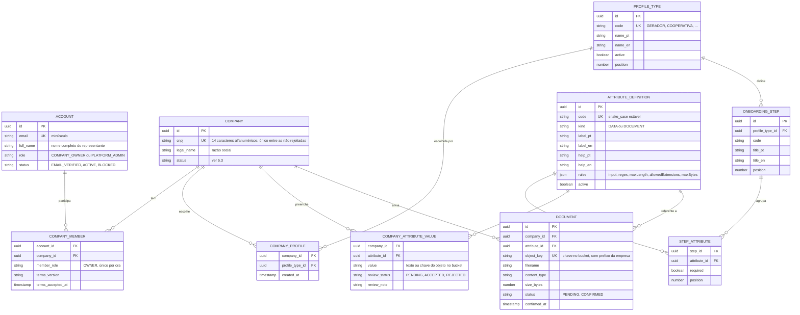

# Proposta: sign-up / sign-in com JWT e onboarding configurável

> **Status:** rascunho para discussão · **Escopo:** MVP · **Repo:** `ecolchain-management-api`
>
> Para a conversa, o essencial está nas seções 3 (decisões D1 a D13), 4 (C4) e 6 (decisões registradas e pendências). Os anexos A a D têm o detalhe: modelo de dados, endpoints, segurança e a matriz de atributos por perfil.
>
> A matriz de dados e documentos por tipo de perfil já chegou e vira seed no **anexo D**.

Os diagramas são Mermaid: o GitHub renderiza direto e o preview de Markdown do IntelliJ também (pode pedir para baixar a extensão na primeira vez).

## 1. Resumo e escopo

1. **E-mail + código (OTP), sem senha.** O mesmo fluxo faz sign-up e sign-in.
2. **JWT** emitido pela própria API (RS256): access token curto + refresh token rotativo. Chaves geradas localmente no MVP.
3. **Cadastro em 2 passos:** (1) e-mail + código; (2) CNPJ, razão social, nome completo e **tipo(s) de perfil** — a empresa pode ter mais de um.
4. **Onboarding dinâmico:** depois do cadastro o app pede dados e documentos conforme os tipos de perfil escolhidos. Tipos, atributos e passos são **dados no banco, editados por endpoints de admin**: mudar o fluxo não exige deploy.
5. **Documentos** vão do navegador direto para o OCI Object Storage (URL pré-assinada). O banco guarda só a **chave (string)**.
6. **Revisão pelo admin** (aprova, pede ajustes ou rejeita) antes de a empresa ficar `APPROVED`. Antes da aprovação, a empresa **só vê o status**.
7. **Hexagonal + API-first** (ver 3.2): contrato OpenAPI primeiro, controllers implementam interfaces geradas, envelope `{data, links, erros}` obrigatório, doc por use case.

**Dentro do MVP:** PJ (CNPJ); 1 login por empresa, do dono ou representante legal.
**Fora, por enquanto:** operadores e funcionários, PF, senha e 2FA, KYC automático, vínculo com carteira on-chain, painel web do admin (no MVP o admin usa Bruno ou curl) e troca de e-mail ou de titular do login (no MVP, só o admin faz, como suporte).

| Pedido | Onde está |
|---|---|
| Sign-in e sign-up com JWT no Quarkus, simples e seguro | D1 a D4, 5.1 |
| Chaves geradas localmente (MVP) | D3, C.1 |
| Cadastro por e-mail + código via OCI Email Delivery | D1, D11, 5.1, C.2 |
| CNPJ, nome completo, razão social, tipo de perfil | D10, 5.1 |
| Tipos de perfil servidos por endpoint do admin (6 iniciais) | D6, A, B |
| Só PJ; dono ou representante legal | D10, 5.1 |
| Documentos por tipo de perfil, valores como string, presign no bucket OCI | D6 a D8, 5.2, A, D |
| Admin muda fluxos sem deploy | D6, 3.1, A |
| Empresa só com o login dela (sem operadores) | D9 |
| Hexagonal, API-first, envelope `{data, links, erros}`, doc por use case | 3.2 |
| Diagrama C4 | 4 |

## 2. O que já existe

| Peça | Hoje | Consequência |
|---|---|---|
| API | Quarkus 3.40 (Java 25), Panache, Flyway, Oracle ADB 23ai (`MGMT_DEV` e `MGMT_PROD`), OpenAPI, logs JSON. Pacote único `com.ecolchain.api` | Entram `quarkus-smallrye-jwt`, `quarkus-smallrye-jwt-build` e `quarkus-mailer`. Direção já definida no `AGENTS.md`: **API-first** (contrato OpenAPI primeiro, interfaces geradas pelo OpenAPI Generator, implementação depois) |
| Documentos | `DocumentStorageService` gera URLs pré-assinadas (PUT 10 min, GET 5 min, máx. 25 MiB, extensões em allow-list). `DevDocumentResource` só existe no profile `dev`, **não tem auth** e é temporário (será substituído). A chave (`docs/<uuid>-<arquivo>`) **não tem dono** | Reaproveitar o serviço. O upload-url vira `POST` e cria uma intenção de upload (`DOCUMENT`), com prefixo por empresa e checagem de dono (D8) |
| E-mail | Módulo Terraform `oci/email-delivery` em andamento (branch `feat/oci-email-delivery` do infra): Email Domain `ecolchain.com`, DKIM no Cloudflare, Approved Sender `ecolchain@ecolchain.com`, credencial SMTP. O README da API já documenta o uso (SMTP 465 com TLS implícito, mock em dev e test). **Limite da tenancy: 200 e-mails/24 h e 10/min** | Base do envio do OTP (D11). O limite exige rate limit desde o primeiro dia |
| Front | O SPA desta plataforma **ainda não existe**: será o repo `ecolchain-management-web`. O `ecolchain-core-web` (React; `app.ecolchain.com`) continua só com carteira Solana | O Management Web nasce consumindo `/auth` e `/me`. O login da empresa é separado da carteira |
| Hospedagem da API | Ainda não existe no infra; por ora **tudo roda local** (`quarkus:dev`), máquina OCI depois | Cookie, CORS e entrega das chaves ficam parametrizados para quando o deploy chegar |
| On-chain | `Participante.kyc_hash` é informado pelo operador no cadastro on-chain. Os papéis on-chain (Coletor, Cooperativa, Transportador, Indústria) diferem dos 6 tipos desta proposta | Futuro: esta API vira a fonte do cadastro/KYC off-chain e do `kyc_hash`. Fora do escopo agora |

## 3. Decisões propostas

| # | Tema | Proposta | Por quê / alternativa |
|---|---|---|---|
| D1 | Credencial | E-mail + código numérico (OTP) de 6 dígitos, **sem senha**. O mesmo `request`/`verify` serve para sign-up e sign-in | Não há senha para guardar, vazar ou resetar, e a resposta é igual exista ou não a conta (sem enumeração). Alternativa: senha + OTP só no cadastro (mais atrito e mais superfície) |
| D2 | Sessão | **Access JWT** de 15 min (RS256) + **refresh token opaco** de 7 dias, rotativo, com detecção de reuso. Refresh em cookie `HttpOnly; Secure; SameSite=Strict; Path=/auth`; access em memória no SPA | Token curto limita o estrago e o refresh permite logout e revogação de verdade. Exige a API sob `*.ecolchain.com` (mesmo site do SPA); se não der, o refresh vai no corpo da resposta. Alternativa mais simples: um único JWT de 1 a 8 h, sem revogação |
| D3 | Chaves JWT (MVP) | Par RSA 2048 gerado por script; **dev e prod commitadas em `keys/`** (decisão explícita do dono, é MVP). `kid` no header desde já | Detalhes em C.1. Débito técnico registrado: mover para secret/OCI Vault e JWKS na evolução |
| D4 | Autorização | Claim `groups` = `COMPANY_OWNER` ou `PLATFORM_ADMIN`; `@RolesAllowed` por prefixo (`/me/**`, `/admin/**`); deny by default nas demais rotas. Estado da conta e da empresa é lido do banco, não do token. Em `/admin/**` o papel também é conferido no banco | O token só prova identidade. Regra de negócio fica sempre no servidor, e a conferência no banco reduz o estrago se a chave vazar |
| D5 | Admin | `leandroluz201616@mail.com` semeado por migration como `PLATFORM_ADMIN` (o login é o mesmo OTP de todo mundo); novos admins via INSERT no banco por ora | Bootstrap mínimo. Depois: convite de admins por endpoint e 2º fator |
| D6 | Catálogo dinâmico | `PROFILE_TYPE` → `ONBOARDING_STEP` → `STEP_ATTRIBUTE` → `ATTRIBUTE_DEFINITION` no banco, editados por endpoint. A API devolve o **schema do formulário** e o SPA só renderiza. Empresa pode ter **N tipos** (`COMPANY_PROFILE`); o schema servido é a **união** dos fluxos, sem repetir atributo. Rótulos bilíngues (`label_pt`/`label_en`, `help_pt`/`help_en`) | Exigir outro documento ou dado vira 1 chamada, sem deploy da API nem do SPA |
| D7 | Valores | Tudo `VARCHAR2`: dado = texto; documento = **chave do objeto** no bucket | Como pedido. A validação (regex, tamanho, extensão) vem das `rules` do atributo e só pode **restringir** a política global (`app.docs.*`) |
| D8 | Documentos | `POST upload-url` cria uma intenção de upload (`DOCUMENT` PENDING) e devolve o presign PUT → upload direto → `confirm` (a API faz HEAD no objeto, marca `CONFIRMED` e grava a chave no atributo). Chave `docs/<companyId>/<atributo>/<uuid>-<arquivo>`; a API só confirma chaves que ela mesma emitiu para aquela empresa | Impede que uma empresa "reivindique" arquivo de outra (IDOR) e deixa rastro de uploads órfãos para limpeza. Reaproveita TTL e limite atuais |
| D9 | Tenant | `ACCOUNT` ↔ `COMPANY_MEMBER` (role `OWNER`) ↔ `COMPANY`, com 1 membro por empresa | Operadores e funcionários entram depois com novas linhas e convite, sem migrar dados |
| D10 | Empresa (PJ) | Núcleo fixo: CNPJ, razão social, nome completo, tipo(s) de perfil (1..N). CNPJ validado por dígito verificador (**já aceita o formato alfanumérico**, em vigor desde jul/2026) e único entre as empresas não rejeitadas; consulta pública opcional só para pré-preencher a razão social. Declaração "sou dono ou representante legal" + aceite de termos versionado. Troca de tipos **livre até submeter** — os requisitos são recalculados na hora | **Nome completo** (a pessoa) e **razão social** (a empresa) não são a mesma coisa: coincidem só em EI e MEI (no MEI a razão social vem com o CPF). Pedimos os dois |
| D11 | E-mail | OCI Email Delivery por SMTP via Quarkus Mailer, como já definido no módulo de infra e no README. Mock em dev e test | Detalhes em C.2 |
| D12 | Aprovação | Revisão manual do admin: aprova, pede ajustes (com motivo) ou rejeita, por documento e no geral. Antes de aprovar, a empresa **só consulta o status** — não acessa nenhuma outra funcionalidade. Requisito novo publicado pelo admin empurra empresas `APPROVED` daquele tipo para `PENDING_UPDATE` (a "rota de pendente"), que volta para `UNDER_REVIEW` ao resubmeter | Mínimo razoável para cadastro regulado. Evolui para regras automáticas |
| D13 | Envelope e erros | Toda resposta segue `{ "data": {} | null, "links": [], "erros": [] }` — `links` carrega HATEOAS útil ao SPA (ex.: próximo passo) e `erros` traz **objetos Problem Details da RFC 9457** (`type`, `title`, `status`, `detail`, `instance`) mais as extensões `code` (estável, ex.: `OTP_INVALID`, `CNPJ_IN_USE`) e `campo` (opcional). Na auth, código errado, expirado ou inexistente devolve sempre o mesmo `code`. Um único grupo de mappers (`ExceptionMapper`/`@ServerExceptionMapper` — o "ControllerAdvice" do Quarkus) monta o envelope | O SPA traduz pelo `code`, sem depender de texto. Hoje o `DevDocumentResource` devolve `{"error": "..."}` ad hoc |

**Alternativa descartada no MVP:** IdP gerenciado (OCI IAM Identity Domains, Keycloak, Auth0). Entrega MFA, reset e login social prontos, mas é mais uma peça para operar e pagar, e o onboarding dinâmico continuaria sendo da API. Se um dia entrar, tende a ser troca de configuração de verificação do token, não de regra de negócio.

### 3.1 O que é dinâmico e o que é estático

| Dinâmico (admin, por endpoint, sem deploy) | Estático (código ou config, muda com deploy ou restart) |
|---|---|
| Tipos de perfil: nome, descrição, ativo, ordem | Núcleo da empresa: e-mail, CNPJ, razão social, nome completo, tipo |
| Atributos: rótulo, ajuda, `DATA` ou `DOCUMENT`, regras (regex, tamanho, extensões) | OTP e JWT: algoritmo, TTLs, limites de tentativa |
| Passos do fluxo, ordem, obrigatório ou opcional | Roles e matriz de autorização |
| Decisões de revisão por documento e por empresa | Máquina de estados da empresa e política global de upload (`app.docs.*`) |

Os parâmetros de segurança ficam estáticos de propósito: menos superfície de ataque se um admin for comprometido.

### 3.2 Arquitetura de código (hexagonal + API-first)

Decisões do dono, registradas também no `AGENTS.md`:

- **API-first**: o contrato `openapi/management-api.yaml` é a fonte da verdade — os endpoints do anexo B viram `paths` e `schemas` ali. O plugin do OpenAPI Generator gera as interfaces JAX-RS e os controllers as implementam; nada de endpoint criado fora do contrato.
- **Hexagonal por contexto**: `domain` puro (sem Quarkus), `application` com `port.in` (use cases) e `port.out` (stores, mail, storage, issuer), e `adapter` (`in.web` = controllers que implementam as interfaces geradas, `out.persistence` = Panache, `out.storage` = S3, `out.mail` = SMTP, `out.security` = JWT). Controller só traduz HTTP↔use case.
- **Idiomas**: código em inglês; campos do contrato (request/response) em pt-BR camelCase (`razaoSocial`, `nomeCompleto`, `tiposPerfil`); paths em inglês.
- **Payloads**: schemas do contrato chamados `<Nome>Request`/`<Nome>Response`, gerados no pacote `contract.model`. Payloads manuais (se houver) ficam em `request`/`response` da feature. Nunca `*Dto`.
- **Envelope**: um único `ApiResponse` (`data`, `links`, `erros`), montado num só lugar — controllers retornam o `data` e um grupo de `ExceptionMapper`/`@ServerExceptionMapper` converte exceções de domínio em itens RFC 9457 dentro de `erros`.
- **Doc por use case**: `docs/features/<feature>.md` descreve o fluxo; a classe referencia o arquivo no Javadoc. Mudou o código sem atualizar o doc = PR incompleto.
- **Clean Code + SOLID**, sem gambiarras.

```text
com.ecolchain.api
├── common                 # ApiResponse, ProblemFactory, mappers, config
├── identity               # auth, conta, sessão
│   ├── domain             # OtpPolicy (HMAC/TTL/tentativas), rotação de refresh
│   ├── application
│   │   ├── port.in        # RequestOtp, VerifyOtp, RefreshSession, Logout, GetMe
│   │   ├── port.out       # AccountStore, OtpStore, RefreshTokenStore, MailSender, TokenIssuer
│   │   └── usecase
│   └── adapter
│       ├── in.web         # AuthController (implementa a interface gerada)
│       ├── out.persistence# PanacheAccountRepository, ...
│       ├── out.mail       # SmtpMailSenderAdapter (Quarkus Mailer)
│       └── out.security   # SmallRyeJwtIssuer
├── onboarding             # empresa, schema dinâmico, valores, submit
├── catalog                # tipos de perfil, passos, atributos (admin)
└── documents              # presign/confirm — DocumentStorageService vira adapter.out.storage
```

## 4. Arquitetura (C4)

Notação C4 (pessoa, sistema, container, componente) desenhada com `flowchart` do Mermaid, porque o `C4Context` nativo do Mermaid sobrepõe rótulos e cruza setas quando passa de umas 5 relações.

### 4.1 Contexto (nível 1)



Legenda: azul-escuro = pessoa; azul = sistema; azul médio = container; azul claro = componente; cinza = sistema externo; tracejado = fronteira do que está em foco. Entre colchetes, o tipo e a tecnologia.

### 4.2 Containers (nível 2)



### 4.3 Componentes: autenticação (nível 3)



O `JWT Guard`, que valida o Bearer nas rotas `/me` e `/admin`, está em 4.4. O mesmo desenho em camadas (controller → port in → use case → port out → adapter) vale para os outros contextos.

### 4.4 Componentes: onboarding e catálogo (nível 3)



Os adapters de persistência falam com o Autonomous Database via Panache (setas omitidas para legibilidade; ver 4.2). O layout de pacotes completo está em 3.2.

O diagrama de deployment fica para quando a hospedagem da API for definida (pergunta 9). Os fluxos dinâmicos estão na seção 5.

## 5. Fluxos

### 5.1 Sign-up e sign-in (mesmo caminho)



### 5.2 Documento (presign → upload direto → confirmação)



### 5.3 Estados da empresa



O `nextStep` é calculado no servidor a partir desses estados — `PENDING_UPDATE` também leva ao ONBOARDING (a tela indica os novos documentos a submeter). O SPA não carrega regra de fluxo.

## 6. Decisões registradas (respostas do dono)

| # | Pergunta | Decisão |
|---|---|---|
| 1 | Lista de dados/documentos por perfil | Recebida — virou a matriz do anexo D (seed por migration) |
| 2 | Senha ou 2FA | Sem senha: OTP de e-mail para todo mundo, inclusive admin |
| 3 | Acesso antes da aprovação | **Só o status.** Admin da Ecolchain valida os documentos e aprova |
| 4 | Troca de tipo de perfil | Livre até submeter; os requisitos são recalculados conforme os tipos |
| 5 | Requisito novo com empresa aprovada | **Valem.** A empresa vai para `PENDING_UPDATE` e a tela indica os novos documentos (ver 5.3) |
| 6 | Vários tipos por empresa | **Sim** (`COMPANY_PROFILE`), embora raro |
| 7 | Nome completo e razão social | Os dois (D10) |
| 8 | Idiomas dos rótulos | **pt-BR e en** — colunas `label_pt`/`label_en` (e `help_pt`/`help_en`) |
| 9 | Hospedagem | Máquina OCI depois; por ora tudo local — cookie/CORS parametrizados |
| 10 | Chaves JWT | **Dev e prod commitadas** em `keys/` (débito técnico assumido; C.1) |

### Pendências menores (não bloqueiam)

- Você mandou uma **senha** para o admin (`ecolchain1234@`), mas o login é sem senha (código por e-mail). Mantemos OTP para o admin também — certo? Se quiser senha, vira decisão nova (e bem mais superfície).
- O e-mail é `leandroluz201616@mail.com` mesmo? Confirmo se não era `@gmail.com` antes de semear.
- Gov.br / SINIR / SIGOR: **não há integração** no MVP — os números/comprovantes são dados e documentos conferidos manualmente pelo admin na revisão.
- Documentos "da diretoria" e "dos sócios" entram como **1 documento consolidado** cada (`board_personal_docs`, `partners_personal_docs`). Se preferir um atributo por item (RG, CPF, comprovante), é só ajustar o seed — o modelo já permite.

## 7. Entrega em fatias

Cada fatia começa pelo trecho correspondente do contrato OpenAPI (API-first, como definido no `AGENTS.md`), depois as interfaces geradas, depois a implementação e os testes. Cada use case nasce com seu `docs/features/<nome>.md`.

1. **Base:** `openapi/management-api.yaml` (seções de auth e `/me`), plugin do OpenAPI Generator no `pom.xml`, envelope `ApiResponse` + mappers de erro, esqueleto de pacotes hexagonais.
2. **Auth:** migrations de identidade (`ACCOUNT`, `EMAIL_OTP`, `REFRESH_TOKEN`, seed do admin), chaves RSA em `keys/` com exceção do `.gitignore`, use cases de OTP/JWT, `/auth/*` e `/me`, com testes (`MockMailbox`).
3. **Catálogo e cadastro:** migrations do catálogo + seeds dos 6 tipos com a matriz do anexo D, use cases de admin (tipo, fluxo, atributo), `PUT /me/company` (multi-perfil), `GET /me/onboarding` com o schema unificado.
4. **Documentos e revisão:** entidade `DOCUMENT`, presign com prefixo e checagem de dono (substitui o `DevDocumentResource`), `confirm`, `submit`, `review` e o efeito `PENDING_UPDATE` ao publicar requisito novo; auditoria.
5. **Em paralelo:** coleção Bruno com os fluxos; o Management Web (repo separado) já consome o contrato; hospedagem OCI e aplicação do módulo de Email Delivery quando você mexer na infra.

---

## Anexo A. Modelo configurável



Fora do diagrama: `EMAIL_OTP` (e-mail, hash do código, expiração, tentativas, consumido em), `REFRESH_TOKEN` (conta, família, hash, expiração, revogado em, substituído por) e `AUDIT_LOG` (ator, ação, entidade, antes, depois, quando).

Pontos de projeto:

- O **atributo é reutilizável**: o mesmo `env_operating_license` pode entrar no fluxo de vários tipos, cada um com seu `required` e sua posição. A definição é **global**: mudar `label_*` ou `rules` afeta todos os tipos que usam o atributo.
- **Multi-perfil:** a empresa escolhe 1..N tipos (`COMPANY_PROFILE`); o schema servido é a união dos passos/atributos dos tipos, **sem repetir** um atributo já presente (dedup por `code`). Troca de tipos é livre até submeter e recalcula os requisitos (decisão 4).
- Tirar um atributo do fluxo **não apaga** valores já coletados (ficam para auditoria).
- Mudança de fluxo vale para quem ainda não submeteu **e** empurra empresas `APPROVED` do tipo alterado para `PENDING_UPDATE`, que resubmetem os itens novos (decisão 5, ver 5.3).
- `code` do atributo é a identificação estável (imutável) usada nos endpoints. Não confundir com a `objectKey` do bucket.
- Num atributo `DOCUMENT`, o valor guarda só a `objectKey` (string, como pedido). Os metadados do arquivo (nome, tipo, tamanho, estado do upload) ficam em `DOCUMENT`.
- A regex do admin só roda depois de checar `maxLength` (entrada limitada), para evitar ReDoS.
- **CNPJ reservado por terceiros:** como só provamos o e-mail, alguém poderia cadastrar primeiro o CNPJ de outra empresa. Por isso o CNPJ é único só entre empresas não rejeitadas: o admin rejeita o cadastro indevido e o CNPJ volta a ficar livre. Quem tenta um CNPJ já em uso vê uma mensagem para falar com a Ecolchain.

### Exemplo (ilustrativo): admin define o fluxo de um tipo em uma chamada

```http
PUT /admin/profile-types/COOPERATIVA/flow
```

```json
{
  "passos": [
    {
      "codigo": "licencas",
      "tituloPt": "Licenças e autorizações",
      "tituloEn": "Licenses and authorizations",
      "atributos": [
        {
          "codigo": "env_operating_license",
          "obrigatorio": true,
          "definicao": {
            "tipo": "DOCUMENT",
            "rotuloPt": "Licença Ambiental de Operação (LAO)",
            "rotuloEn": "Environmental Operating License",
            "ajudaPt": "PDF de até 10 MB",
            "ajudaEn": "PDF up to 10 MB",
            "regras": { "extensoesPermitidas": ["pdf"], "tamanhoMaxBytes": 10485760 }
          }
        },
        { "codigo": "monthly_capacity_kg", "obrigatorio": false }
      ]
    }
  ]
}
```

`definicao` é opcional: se o atributo já existe e a chamada não traz definição, ele é reaproveitado; se traz, é criado ou atualizado (upsert por `codigo`). O `PUT` substitui o fluxo inteiro em uma transação, o que permite versionar o JSON de cada tipo no Git e reaplicar em dev e prod. `POST /admin/profile-types` aceita o mesmo `passos`, então criar o tipo e seus atributos também é uma chamada só.

### Exemplo (ilustrativo): o que o SPA recebe em `GET /me/onboarding`

```json
{
  "data": {
    "status": "PENDING_DOCUMENTS",
    "tiposPerfil": [{ "codigo": "COOPERATIVA", "nome": "Cooperativa" }],
    "passos": [
      {
        "codigo": "licencas",
        "titulo": "Licenças e autorizações",
        "atributos": [
          {
            "codigo": "env_operating_license",
            "tipo": "DOCUMENT",
            "rotulo": "Licença Ambiental de Operação (LAO)",
            "ajuda": "PDF de até 10 MB",
            "obrigatorio": true,
            "regras": { "extensoesPermitidas": ["pdf"], "tamanhoMaxBytes": 10485760 },
            "valor": null,
            "revisao": null
          }
        ]
      }
    ],
    "progresso": { "totalObrigatorios": 1, "preenchidosObrigatorios": 0 }
  },
  "links": [
    { "rel": "submit", "href": "/me/onboarding/submit", "metodo": "POST" }
  ],
  "erros": []
}
```

E um erro no mesmo envelope (`erros[]` = Problem Details RFC 9457 + `code`/`campo`):

```json
{
  "data": null,
  "links": [],
  "erros": [
    {
      "type": "urn:ecolchain:problem:cnpj-in-use",
      "title": "CNPJ já cadastrado",
      "status": 422,
      "detail": "Este CNPJ já está em uso por outra empresa. Fale com a Ecolchain.",
      "instance": "/me/company",
      "code": "CNPJ_IN_USE",
      "campo": "cnpj"
    }
  ]
}
```

## Anexo B. Endpoints

Paths em inglês, como o código atual. Esta tabela é o rascunho dos recursos para o contrato OpenAPI, que é escrito **primeiro** (API-first, ver `AGENTS.md`); as interfaces JAX-RS saem do OpenAPI Generator. Campos de request/response em pt-BR camelCase e toda resposta envelopada em `{data, links, erros}` (D13, 3.2).

**Públicos**

| Método | Path | Descrição |
|---|---|---|
| POST | `/auth/otp/request` | `{email}`. Sempre 202 |
| POST | `/auth/otp/verify` | `{email, code}`. Devolve o access token e o cookie de refresh |
| POST | `/auth/refresh` | Cookie. Rotaciona o refresh e devolve novo access |
| POST | `/auth/logout` | Cookie. Revoga a família de refresh |
| GET | `/public/profile-types` | Tipos ativos, para o select do cadastro (cacheável) |
| GET | `/.well-known/jwks.json` | Chaves públicas (opcional no MVP) |

**Empresa (`COMPANY_OWNER`)**

| Método | Path | Descrição |
|---|---|---|
| GET | `/me` | Conta, empresa e `nextStep` |
| PUT | `/me/company` | Cria a empresa: CNPJ, razão social, nome completo, tipo, declaração e aceite de termos |
| GET | `/me/onboarding` | Schema dinâmico, valores atuais e status |
| PUT | `/me/onboarding/attributes/{code}` | Grava o valor de um atributo `DATA` |
| POST | `/me/onboarding/documents/{code}/upload-url` | Presign PUT |
| POST | `/me/onboarding/documents/{code}/confirm` | Confirma o upload (HEAD) e grava a chave |
| GET | `/me/onboarding/documents/{code}/download-url` | Presign GET |
| POST | `/me/onboarding/submit` | Confere os obrigatórios e envia para revisão |

**Admin (`PLATFORM_ADMIN`)**

| Método | Path | Descrição |
|---|---|---|
| GET, POST, PATCH | `/admin/profile-types[/{code}]` | CRUD de tipos (desativar em vez de apagar). `POST` aceita `steps` |
| PUT | `/admin/profile-types/{code}/flow` | Define passos e atributos de um tipo, de forma declarativa e atômica |
| GET, POST, PUT | `/admin/attributes[/{code}]` | Catálogo de atributos |
| GET | `/admin/companies?status=` | Fila de revisão |
| GET | `/admin/companies/{id}` | Empresa e valores |
| GET | `/admin/companies/{id}/documents/{code}/download-url` | Presign GET para revisar |
| POST | `/admin/companies/{id}/review` | `{decision, note, items[]}` com `APPROVE`, `REQUEST_CHANGES` ou `REJECT` |
| GET | `/admin/audit-log` | Trilha de mudanças de catálogo e revisões |

## Anexo C. Segurança, chaves e e-mail

### C.1 Chaves JWT no MVP

JWT não precisa de certificado X.509, só do par de chaves. **Decisão do dono (MVP): os pares de dev e prod ficam commitados em `keys/`** — a privada inclusive. O `.gitignore` (que hoje bloqueia `*.pem`/`*.key`) ganha exceção para `keys/`, e o `ConfigGuardTest` faz allow-list dessa pasta.

```bash
mkdir -p keys
openssl genpkey -algorithm RSA -pkeyopt rsa_keygen_bits:2048 -out keys/jwt-private-dev.pem
openssl pkey -in keys/jwt-private-dev.pem -pubout -out keys/jwt-public-dev.pem
openssl genpkey -algorithm RSA -pkeyopt rsa_keygen_bits:2048 -out keys/jwt-private-prod.pem
openssl pkey -in keys/jwt-private-prod.pem -pubout -out keys/jwt-public-prod.pem
```

Configuração (exemplo; validar os caminhos na implementação). As chaves de prod ficam sob o profile `%prod`:

```properties
mp.jwt.verify.issuer=ecolchain-management-api
mp.jwt.verify.audiences=ecolchain-app
smallrye.jwt.new-token.issuer=ecolchain-management-api
smallrye.jwt.new-token.audience=ecolchain-app
smallrye.jwt.new-token.lifespan=900
%dev.mp.jwt.verify.publickey.location=keys/jwt-public-dev.pem
%dev.smallrye.jwt.sign.key.location=keys/jwt-private-dev.pem
%prod.mp.jwt.verify.publickey.location=keys/jwt-public-prod.pem
%prod.smallrye.jwt.sign.key.location=keys/jwt-private-prod.pem
```

- **Risco assumido:** quem tem acesso ao repo assina token de qualquer conta, inclusive admin — por isso `/admin/**` também confere o papel no banco (D4) e `kid` já sai no header para a rotação futura não quebrar tokens em voo.
- **Débito técnico registrado:** na evolução, as chaves saem do repo para secret montado no deploy e depois OCI Vault, com JWKS publicando chaves sobrepostas durante a rotação. O `keys/` continua útil só para dev.

### C.2 E-mail (OCI Email Delivery)

A infra (domínio, DKIM, sender, credencial SMTP) e a configuração do Mailer já estão sendo tratadas no módulo `oci/email-delivery` e no README da API. Para o fluxo de auth, o que importa:

- O `From` precisa ser exatamente o Approved Sender (`ecolchain@ecolchain.com`).
- **Limite de 200 e-mails/24 h e 10/min** na tenancy: cada login sem refresh válido gasta um e-mail, e quem esgota a cota derruba o login de todo mundo. Mitigações: refresh de 7 dias, cooldown por e-mail e por IP, teto global diário com erro amigável quando perto do limite e, antes de abrir ao público, Cloudflare Turnstile no `request`. Aumento de limite exige SPF e DKIM (ver README do infra).
- O envio acontece **depois do commit** da transação, e o `request` nunca revela se o e-mail existe.
- Em `quarkus:dev` e nos testes o Mailer vem em mock (o código aparece no console e o `MockMailbox` lê o e-mail nos testes). Num deploy `dev` o envio é real e gasta a cota.
- O e-mail só leva o código, a validade e "se não foi você, ignore": sem link, para não treinar o usuário a clicar.
- Evolução: a credencial SMTP hoje fica no usuário do Terraform; o ideal é um usuário IAM dedicado só com `use email-family`.

### C.3 Parâmetros iniciais e checklist

Tudo em `application.properties` via `@ConfigMapping(prefix = "app.auth")`, como `DocumentsConfig` já faz.

| Item | Valor inicial |
|---|---|
| OTP | 6 dígitos (`SecureRandom`), validade 10 min, 5 tentativas, uso único. Guardado como HMAC-SHA256 com pepper de config, comparado em tempo constante |
| Reenvio | Cooldown 60 s; máx. 5 por hora por e-mail; teto por IP |
| Access JWT | 15 min, RS256, claims `iss`, `aud`, `sub` (id da conta), `groups`, `jti`; `kid` no header |
| Refresh | 7 dias (30 dias absolutos), 256 bits aleatórios, SHA-256 no banco, rotativo; reuso revoga a família |

Checklist:

- Resposta única para código errado, expirado ou inexistente. Conta `BLOCKED` não recebe token.
- Verificador com algoritmo fixo (sem `none`), validando `iss`, `aud` e `exp`.
- CORS restrito às origens do SPA. Refresh e logout por cookie exigem origem permitida e `SameSite=Strict`.
- Deny by default: tudo exige JWT, exceto `/auth/**`, `/public/**`, health e JWKS.
- Documentos: bucket privado (já é), URLs curtas, tipo e tamanho validados, chave com prefixo da empresa. Sem varredura de malware no MVP: só admin e o titular baixam, por URL assinada.
- Logs JSON (já em uso): nunca registrar OTP, tokens ou e-mail completo.
- Toda mudança de catálogo e toda revisão grava `AUDIT_LOG`.
- LGPD: aceite de termos versionado com data, finalidade e retenção definidas, acesso aos documentos só do titular e do admin.
- Testes: `@QuarkusTest` com `MockMailbox`; validador de CNPJ com o exemplo oficial da Receita (`12.ABC.345/01DE-35`); `ConfigGuardTest` com allow-list de `keys/` (chaves commitadas por decisão do dono, C.1) — os demais segredos continuam bloqueados.

CNPJ: módulo 11 sobre os 12 primeiros caracteres, cada um convertido por `ASCII − 48`, pesos de 2 a 9 da direita para a esquerda. Armazenar como `VARCHAR2(14)` em maiúsculas, nunca como número. A consulta pública é só conveniência e nunca bloqueia: os provedores podem ainda não aceitar o formato alfanumérico.

## Anexo D. Matriz de atributos por tipo de perfil (seed)

Traduzida da lista enviada. `tipo` = `DATA` (texto) ou `DOCUMENT` (arquivo no bucket); `obrig.` = obrigatório no submit. Atributos repetidos entre tipos são **compartilhados** — empresa com vários perfis preenche uma vez só (dedup por `code`). Documentos usam `regras.extensoesPermitidas = ["pdf","jpg","png"]` salvo indicação em contrário. Sem integração com Gov.br/SINIR/SIGOR no MVP: números e comprovantes são conferidos manualmente na revisão (D12).

**Atributos compartilhados** (definidos uma vez, usados em vários tipos):

| code | tipo | rótulo pt |
|---|---|---|
| `full_address` | DATA | Endereço completo |
| `state_registration` | DATA | Inscrição Estadual (IE) |
| `municipal_registration` | DATA | Inscrição Municipal (IM) |
| `primary_cnae` | DATA | CNAE principal |
| `secondary_cnaes` | DATA | CNAEs secundários |
| `sinir_number` | DATA | Registro SINIR / MTR Nacional |
| `sigor_number` | DATA | Registro SIGOR / MTR SP (CETESB) |
| `responsible_cpf` | DATA | CPF do responsável legal |
| `corporate_email` | DATA | E-mail corporativo |
| `phone` | DATA | Telefone |

**GERADOR** — Importadora / cliente solicitante (passos: `dados_empresa`, `cadastros`, `responsavel`)

| code | tipo | obrig. |
|---|---|---|
| `full_address` | DATA | sim |
| `state_registration` | DATA | sim |
| `municipal_registration` | DATA | não |
| `primary_cnae` | DATA | sim |
| `secondary_cnaes` | DATA | não |
| `sinir_number` | DATA | sim |
| `sigor_number` | DATA | não (só SP; admin ajusta por estado) |
| `responsible_cpf` | DATA | sim (vínculo Gov.br conferido na revisão) |
| `corporate_email` | DATA | não |
| `phone` | DATA | sim |

**TRANSPORTADOR** (passo: `cadastros`)

| code | tipo | obrig. |
|---|---|---|
| `sinir_number` | DATA | sim (CNPJ ativo e regularizado) |
| `sigor_number` | DATA | não |

Nota: CNH, documento do veículo/placa, MTR e MOPP/ANTT são **documentos por carga** (operação), não de onboarding — fora por decisão do dono ("sem motoristas ainda").

**COOPERATIVA** (passos: `abertura_legal`, `cadastros_operacao`, `responsavel`)

| code | tipo | obrig. |
|---|---|---|
| `incorporation_minutes` | DOCUMENT | sim — Ata da Assembleia Geral de Constituição |
| `bylaws` | DOCUMENT | sim — Estatuto Social |
| `founding_members_list` | DOCUMENT | sim — Lista de Associados Fundadores |
| `board_personal_docs` | DOCUMENT | sim — RG, CPF e comprovante de residência da diretoria (consolidado) |
| `catadores_sinir_registry` | DATA | sim — habilitação no Módulo Catadores do SINIR |
| `infrastructure_declaration` | DOCUMENT | sim — comprovação de galpão/equipamentos de triagem |
| `responsible_cpf` | DATA | sim |

**CLEANTECH** (passos: `abertura_legal`, `cadastros`, `responsavel`)

| code | tipo | obrig. |
|---|---|---|
| `articles_of_association` | DOCUMENT | sim — Contrato Social (LTDA / Marco Legal das Startups) |
| `partners_personal_docs` | DOCUMENT | sim — documentos pessoais dos sócios (consolidado) |
| `business_permit` | DOCUMENT | sim — Alvará de Funcionamento |
| `primary_cnae` | DATA | sim |
| `secondary_cnaes` | DATA | não |
| `state_registration` | DATA | não — só se comercializa subprodutos |
| `env_operating_license` | DOCUMENT | não — LAO ou dispensa, se houver laboratório/pátio próprio |
| `sinir_api_registration` | DATA | não — cadastro de empresa contratada/usuário API no SINIR |
| `responsible_cpf` | DATA | sim |

**RECICLADORA** — destinador final (passos: `licencas`, `fiscal_operacao`)

| code | tipo | obrig. |
|---|---|---|
| `env_operating_license` | DOCUMENT | sim — LAO ou dispensa do órgão estadual (ex.: CETESB) |
| `env_license_number` | DATA | sim — nº da LAO (obrigatório p/ recebimento no MTR) |
| `env_license_expiry` | DATA | sim — validade da LAO |
| `cdf_capability` | DATA | sim — declaração de que emite CDF vinculado a MTRs |
| `inbound_invoice` | DOCUMENT | sim — NF de entrada (exemplar; créditos e logística reversa) |
| `primary_cnae` | DATA | sim |
| `secondary_cnaes` | DATA | não |

**HIGIENIZADORA** — reuso de garrafas (passos: `licencas`, `fiscal`)

| code | tipo | obrig. |
|---|---|---|
| `env_license_hygiene` | DOCUMENT | sim — LAO/dispensa **com autorização explícita** de lavagem/higienização/reuso |
| `health_permit` | DOCUMENT | sim — CMVS / Alvará Sanitário |
| `state_registration` | DATA | sim |
| `state_registration_proof` | DOCUMENT | sim — comprovante de IE |

Notas:

- `env_license_hygiene` é atributo separado do `env_operating_license` genérico porque exige autorização específica de lavagem — semântica diferente, não só rótulo.
- Condicionais da lista ("se comercializa subprodutos", "se tiver pátio próprio") entram como `obrigatorio: false` no seed. Exigência condicional de verdade (checkbox que liga obrigação) é fase 2 — o modelo comporta.
- Código de resíduo (ex.: 15 01 07) e tecnologia no MTR são escolhas **por operação**, não de onboarding.
- A matriz é só o seed: o admin muda qualquer linha via `PUT /admin/profile-types/{code}/flow`, sem deploy.
